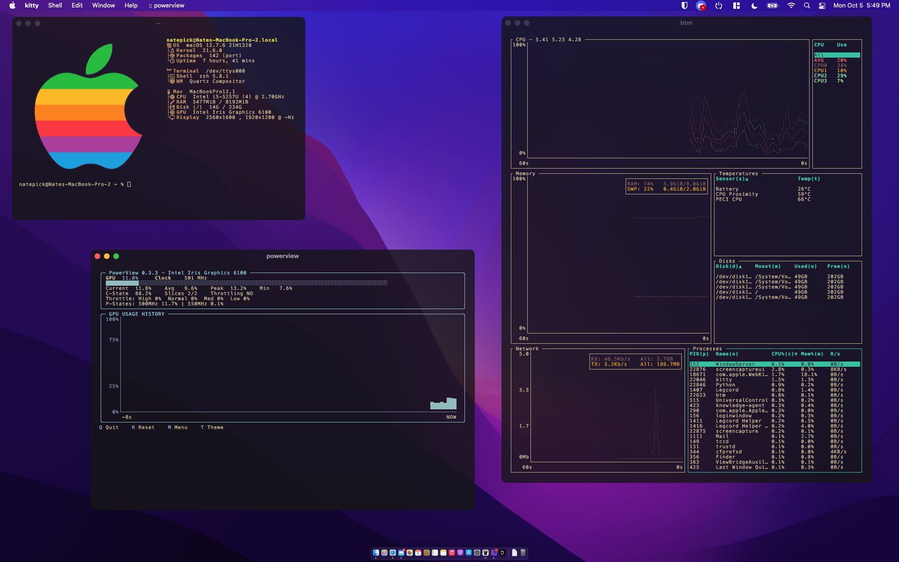

# PowerView

PowerView is a terminal-based GPU monitoring utility for macOS.

It was created to provide an `nvtop`-style GPU monitoring experience on macOS
using Apple's built-in `powermetrics` utility.

PowerView displays live GPU information in a customizable terminal interface
with GPU utilization history, clock information, P-states, throttling data,
and more.

## Features

- Live GPU utilization
- GPU clock frequency
- GPU usage history graph
- Current, average, minimum, and peak GPU utilization
- GPU C-State information
- GPU P-State information
- GPU slice activity
- GPU throttling information
- Adjustable update rate
- Adjustable history length
- Multiple graph styles
- Terminal transparency support
- 16 built-in themes
- Interactive settings menu
- Keyboard-driven interface

## Themes

PowerView includes 16 built-in themes:

- Default
- Catppuccin Mocha
- Catppuccin Macchiato
- Dracula
- Nord
- Gruvbox Dark
- Tokyo Night
- Monokai
- Solarized Dark
- Solarized Light
- One Dark
- Everforest
- Rose Pine
- Kanagawa
- Material
- Synthwave

## Requirements

PowerView currently requires:

- macOS
- Python 3.13
- Apple's built-in `powermetrics`
- Administrator access for the initial permission setup

PowerView itself runs as the normal user. Elevated privileges are only used
by the PowerView helper when accessing Apple's `powermetrics` utility.

## Installation with MacPorts

PowerView is currently pending inclusion in the official MacPorts repository.

Once the PowerView port is accepted into MacPorts, installation will be:

```bash
sudo port selfupdate
sudo port install powerview
```

After installation, PowerView requires a one-time permission setup:

```bash
powerview --setup
```

You will be asked for your administrator password during this setup.

Once setup is complete, launch PowerView normally:

```bash
powerview
```

PowerView does **not** need to be launched with `sudo`.

## Permissions

Apple's `powermetrics` utility requires elevated privileges to access GPU
monitoring information.

PowerView handles this through a small privileged helper. The main PowerView
interface continues to run as your normal user.

When installed through MacPorts, the helper is installed with root ownership
and is not writable by normal users.

Running:

```bash
powerview --setup
```

configures the required permission for the PowerView helper. This only needs
to be done once.

Afterward, PowerView can be started normally with:

```bash
powerview
```

## Controls

PowerView is controlled entirely from the keyboard.

| Key | Action |
| --- | --- |
| `Q` | Quit PowerView |
| `R` | Reset GPU history |
| `M` | Open settings menu |
| `T` | Cycle themes |

Additional settings can be changed from the interactive settings menu.

## Configuration

PowerView includes an interactive settings menu that allows you to configure:

- Theme
- Background mode
- Graph style
- Update rate
- History length
- P-State display
- Throttling information
- GPU slice information

Settings are saved between launches.

### Terminal Transparency

PowerView supports terminal transparency.

When the background mode is set to `terminal`, PowerView does not draw its
own background color. This allows terminal emulators such as Kitty to control
the background and transparency.

Other background modes are available from the settings menu.

## GPU Information

PowerView uses the information exposed by Apple's `powermetrics` utility.

Depending on the Mac and GPU, available information may include:

- GPU utilization
- Active GPU frequency
- C-State residency
- P-State residency
- GPU slice activity
- Throttling information

The exact information available can vary depending on the Mac, GPU, and
version of macOS.

## Limitations

PowerView can only display GPU information that macOS exposes through
`powermetrics`.



Some systems may not provide metrics such as:

- GPU temperature
- Dedicated GPU power consumption
- VRAM usage
- Other hardware-specific sensor information

PowerView does not estimate or invent unavailable GPU statistics.

GPU support and available metrics may vary between Intel, AMD, and Apple
Silicon Macs.

## Why PowerView?

Tools such as `btop` and `bottom` provide excellent system monitoring on
macOS, but detailed GPU monitoring in the terminal is more limited.

PowerView is intended to fill that gap by providing a dedicated,
customizable GPU monitor that can run alongside your preferred system
monitor.

## License

PowerView is released under the MIT License.

Copyright (c) 2026 NatePick
